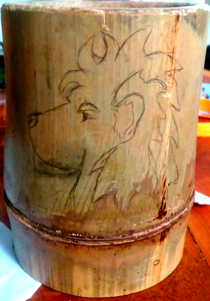
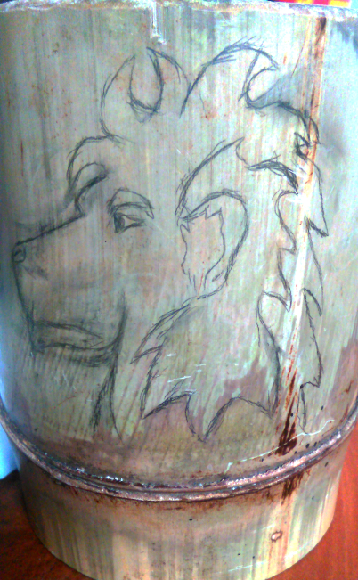
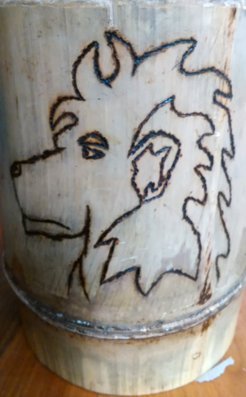
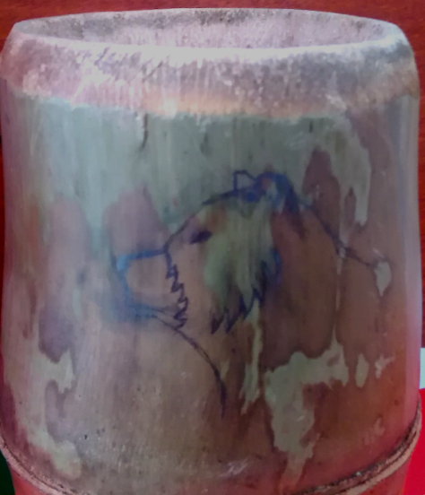
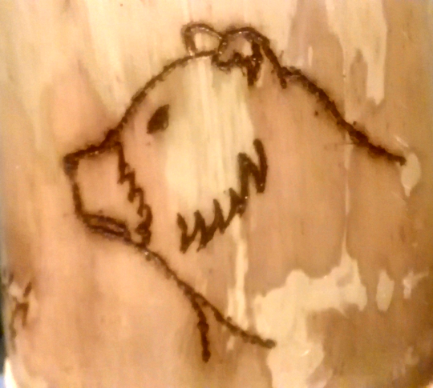
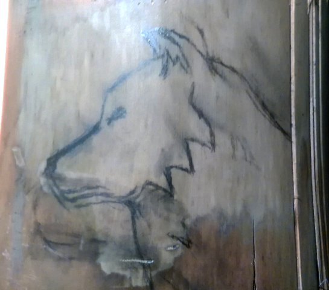
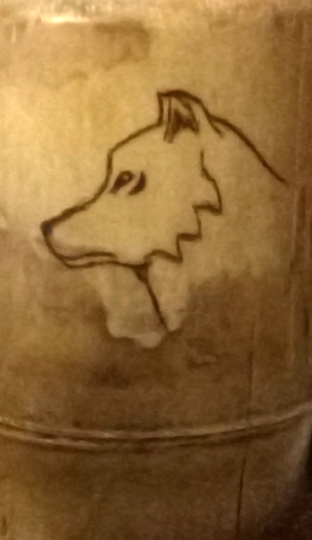

To make this mugs, I got the bamboo from Martinique, as I've been here for holidays.

I just cut the bamboo tree to keep the section as the bottom parts of the glasses. Then, I sanded the edge to make it easier to drink from.

I decorated them with pyrography. I made a few of them for my friends, decorated with animals.

Here is a Lion :

    
    
    

Here is a bear :

    
    

Here is a wolf :

    
    

