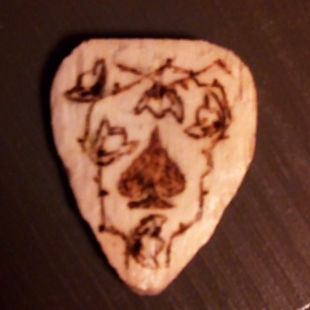
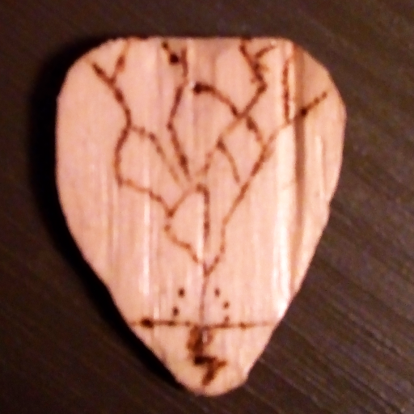
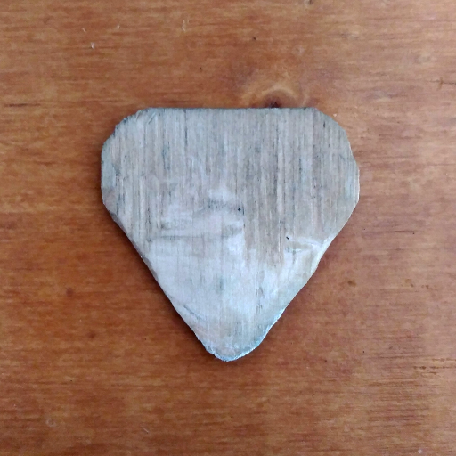
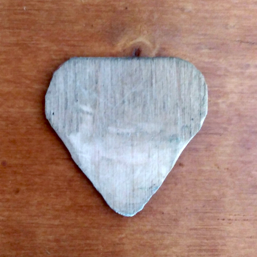

 When I started to try to learn guitar. The idea of creating my own picks emerged

I started doing it by using my plastic one as a patron.

My first attempts were made using only a knife not meant for this use, and I was afraid to make them too thin. And so they resulted in being highly impractical by too fat to be used correctly

But eventually, by sneaking in my father workshop, to borrow some tools, including a wood chisel, I managed to create planes thin enough. I then carved them in the shape of a pick.

I took the time to decorate some of them, as I got the tools meant for it. Despite the fact that I can't draw really well, as it isn't a skill I practiced.

As I wasn't very informed about it, I gave no finishing to my picks.

Here is the pictures of one decorated, and one blank :

    
    
    
    

On the recto of the decorated pick, I tried to represent an Ace of spades, on the verso, a Thunder strike.

