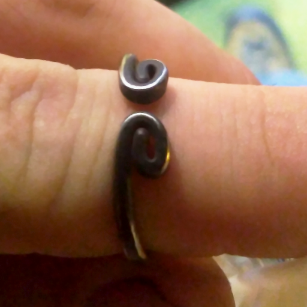
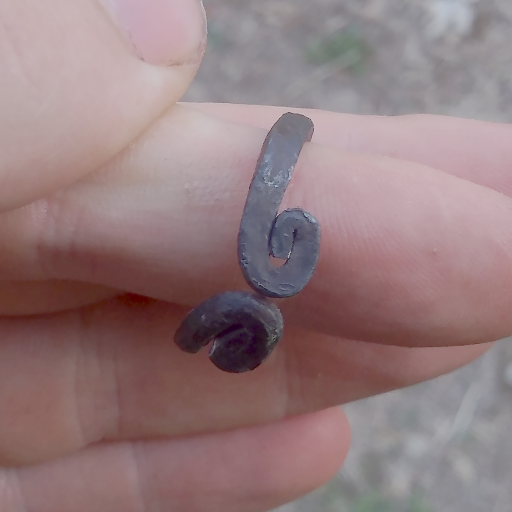
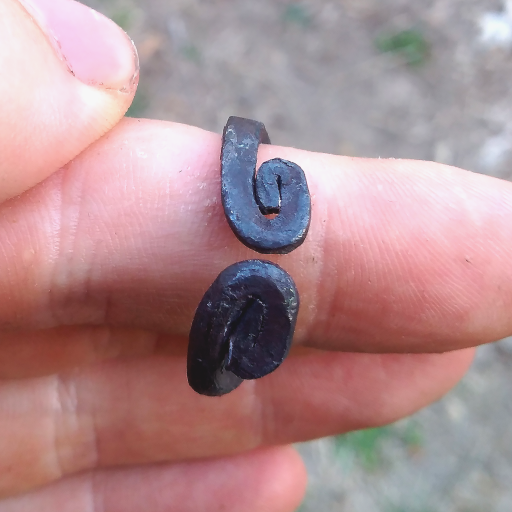
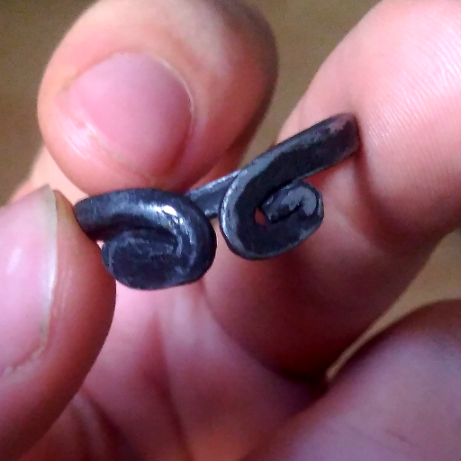
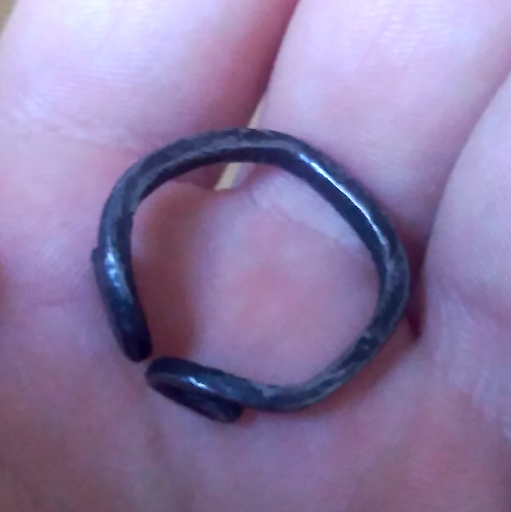
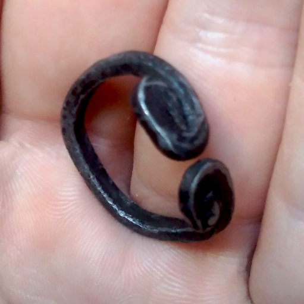

 When I was in Taiwan as a Volunteer, I fell in love with that ring

    

But as it was pretty expensive, and I didn't have a lot of money, I decided to do it myself

To do it, I used a vice as an anvil, and a blowtorch as a forge, because I wasn't working with a lot of metal

The base material was a beer clip, meant to hold the cork in place.

Here is the result :

I'm not 100% pleased with it, and I plan to try again with other clips I collected

