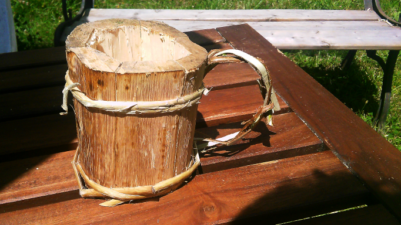
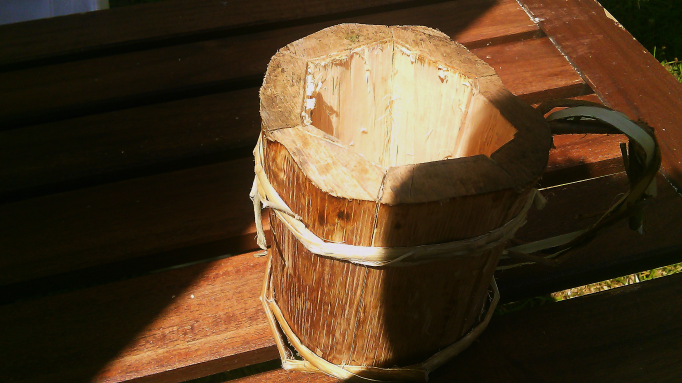
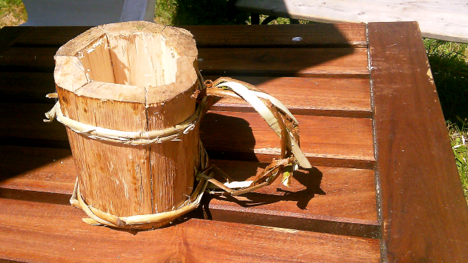

This project was inspired by <a href="https://www.youtube.com/watch?v=ehsMshn5rto">this YouTube video</a>, and I tried to do my own.

But I made a mistake: I took green wood. And when the wood dried, all the pieces shrank, and the joints didn't fit anymore. So I never finished it fully.

Eventually, I used the wood of the pint to do some of my picks.

But I managed to find a log of wood suiting my taste to retry it in the near future

    <figure itemprop="associatedMedia" itemscope itemtype="http://schema.org/ImageObject">
        
        <figcaption itemprop="caption description">A photo of the pint</figcaption>
    </figure>
    <figure itemprop="associatedMedia" itemscope itemtype="http://schema.org/ImageObject">
        
        <figcaption itemprop="caption description">A photo of the pint</figcaption>
    </figure>
    <figure itemprop="associatedMedia" itemscope itemtype="http://schema.org/ImageObject">
        
        <figcaption itemprop="caption description">A photo of the pint</figcaption>
    </figure>

